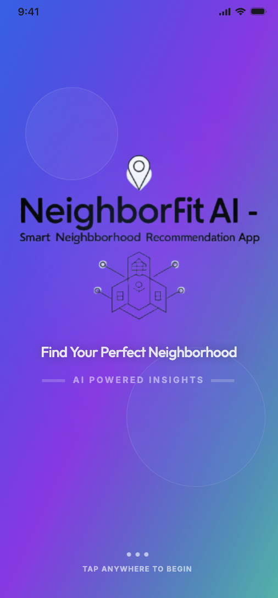
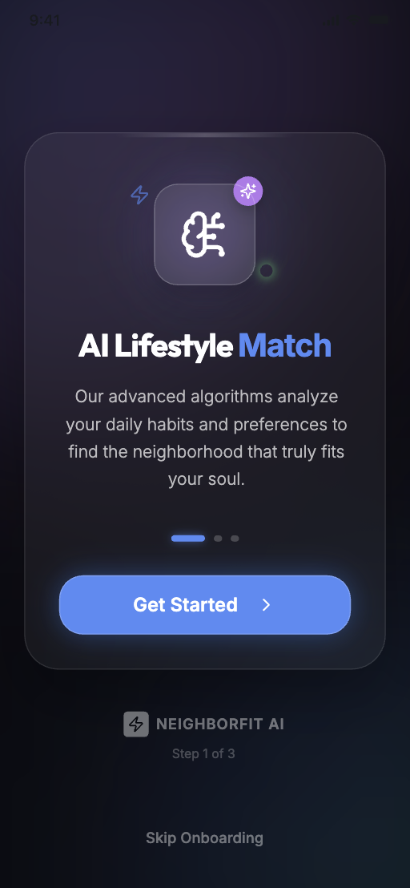
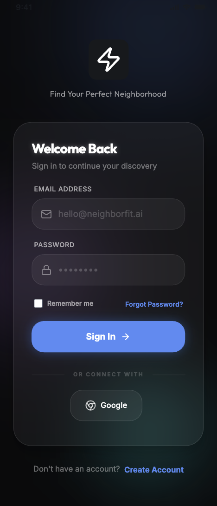
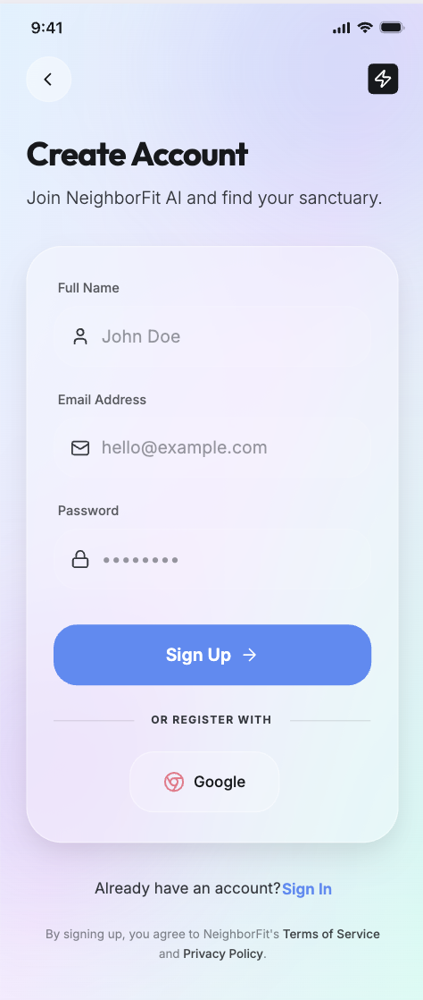

# NeighborFit AI – Smart Neighborhood Recommendation App

## 1. Introduction
NeighborFit AI is a cloud-enabled Android application developed using Kotlin that helps users find the most suitable neighborhood based on their lifestyle preferences.

The app combines **location intelligence, preference-based matching, and social discovery** to create a smarter way to build local communities.

---

# Project Status (March 18, 2026)

The project is currently in the **feature integration phase**.

Completed:

* UI/UX implementation for all major screens
* Firebase Authentication (Login & Registration)
* Navigation flow setup
* Project architecture structure (MVVM + Clean Architecture)

In Progress:

* Firestore data models
* Matching algorithm
* Dashboard data loading
* Map integration
* Favorites system

Planned:

* Real-time neighbor discovery
* Compatibility scoring engine
* Location-based recommendation system

---

# Application Screens

The following UI screens have already been implemented:

1. Splash Screen
2. Onboarding Screens
3. Login / Register
4. Preference Setup Screen
5. Home Dashboard
6. Results Screen
7. Detail Screen
8. Favorites Screen
9. Map Screen
10. Profile Screen
11. Admin Panel

Assets used for UI mockups are currently stored inside:

```
results_screen/
   splash.png
   onboarding.png
   login.png
   signup.png
```

These are **design references and not functional modules**.

---

# Technology Stack

NeighborFit AI is built using modern Android development technologies.

Core Technologies:

* Kotlin
* Android Studio
* MVVM Architecture
* Clean Architecture principles
* Hilt Dependency Injection
* Kotlin Coroutines

Backend & Data:

* Firebase Authentication
* Firestore Database (planned)
* DataStore for local preference storage

Networking & APIs (planned):

* Retrofit
* Google Maps SDK
* Location Services (Fused Location Provider)

---

# Architecture

The application follows a **Clean Architecture pattern** to maintain scalability and separation of concerns.

```
UI (Activity / Fragment)
        ↓
ViewModel
        ↓
UseCase (Domain Logic)
        ↓
Repository
        ↓
DataSource (Firebase / DataStore / APIs)
```

Project structure:

```
app/src/main/java/com/example/neighborfitai/

data/
   repositories
   datastore
   firebase

domain/
   models
   usecases

ui/
   onboarding
   auth
   preferences
   home
   results
   map
   profile
   admin

utils/
di/

MainActivity.kt
```

---

# Current Navigation Flow

```
Splash
   ↓
Onboarding
   ↓
Login / Register
   ↓
Hello World (temporary placeholder)
```

Next milestone:

```
Login
   ↓
Preference Setup
   ↓
Home Dashboard
   ↓
Matching Results
```

---

# Development Setup

To run the project locally:

1. Clone the repository

```
git clone <repository-url>
```

2. Open the project in **Android Studio**

3. Ensure `local.properties` contains your Android SDK path.

Example:

```
sdk.dir=/Users/yourname/Library/Android/sdk
```

4. Sync Gradle dependencies.

5. Build and run on an **Android Emulator or Physical Device**.

---

# Implementation Roadmap

Next development tasks:

### Phase 1 – Core Data Layer

* Create Firestore user models
* Implement DataStore preference storage
* Create repository layer

### Phase 2 – Matching System

* Fetch users from Firestore
* Build compatibility scoring engine
* Filter neighbors by distance

### Phase 3 – Dashboard Integration

* Connect results UI with real data
* Display compatibility score
* Add user interaction logic

### Phase 4 – Map Discovery

* Integrate Google Maps SDK
* Show nearby compatible neighbors
* Enable marker-based profile viewing

### Phase 5 – Social Features

* Favorites system
* Profile editing
* User discovery improvements

---

# App Screenshots

Below are preview screens of the NeighborFit AI application.

## Splash Screen

## Onboarding

## Login Screen

## Signup Screen

<p align="center">
  
  
  
  
</p>

---

# Future Enhancements

Planned improvements for later versions:

* Real-time neighbor matching
* Direct messaging / chat system
* Community event discovery
* Real estate and neighborhood analytics
* AI-based compatibility prediction
* Dark mode & dynamic UI themes

---

# Contributing

Contributions, suggestions, and improvements are welcome.

If you'd like to contribute:

1. Fork the repository
2. Create a feature branch
3. Submit a pull request

---

# License

This project will be released under an open-source license (to be added).

Example options:

* MIT License
* Apache 2.0
* GPL
